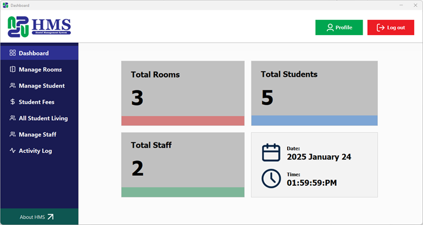

# Hostel Management System

The **Hostel Management System** is a standalone application designed to efficiently manage hostel-related operations. It provides an intuitive interface and robust functionalities to cater to the needs of hostel administrators, staff, and students. The system was developed using **Java** and **MySQL**, ensuring reliability and performance.

This project was developed as a group project at **GEHU.**

## Key Features
### User Roles
- **Admin:**
  - Manage hostel data
  - Export student details to Excel and PDF
  - User role management
- **Staff:**
  - Handle student records
  - Manage room allocations
- **Students:**
  - View personal hostel details
  - Update personal information

## Technologies Used
### Programming Languages
- **Java** - for system logic and user interface
- **MySQL** - for database management

### Development Tools
- **Ecllipse IDE** - Used for coding and project management
- **XAMPP Server** - Used for database management and server hosting

### Libraries Used
- **Apache POI** - Required for exporting data to Excel files
- **FlatLaf** - Enhances the user interface aesthetics
- **iTextPDF** - Enables exporting data to PDF format
- **JCalendar** - Provides calendar selection options
- **MySQL Connector** - Facilitates seamless connection between the MySQL database and the system

## Team Members
The development of this project was carried out by a dedicated team of developers:
- **Aditya Dimri**
- **Priyanshi Bhatt**
- **Pranjali Rathore**
- **Shwetanshu Bhatt**

## Usage
- Login with appropriate credentials based on the user role.
- Navigate through the intuitive dashboard to access various functionalities.
- Export and manage hostel data effortlessly.

